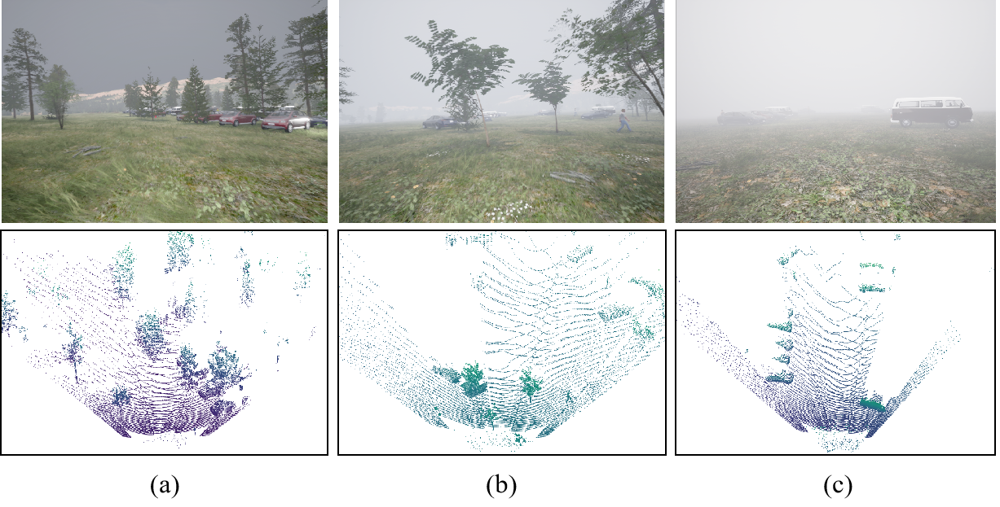

# Welcome to the MLFIS Vision Benchmark Suite! 

To address the lack of method's robustness evaluation, we construct an MLFIS dataset and propose a novel robustness evaluation protocol for diverse extreme interference.  In addition, the dataset mainly contains the car and pedestrian categories.

## Raw Data Acquisition

The MLFIS dataset is constructed based on the CARLA simulator [here](https://carla.org/)  [GITHUB](https://github.com/carla-simulator/carla), which are captured by the 64-line Velodyne LiDAR and RGB camera. The CARLA simulator (Car Learning to Act) is an open-source autonomous driving simulation platform jointly developed by Intel Labs and the Toyota Research Institute. It is based on Unreal Engine and provides high-fidelity urban environments, vehicle sensor models (such as cameras, lidar, GPS, IMU, etc.), and flexibly configurable dynamic traffic scenarios to support the development, training, and validation of 3D object detection and autonomous driving methods.

## Dataset Details

Data Split：

The MLFIS dataset consists of 6,921 training samples (4,500 samples for training and 2,421 samples for validation) and 2,242 test samples, in which 3,985 samples represent mild fog scenarios, 1,815 samples represent moderate fog scenarios, and 3,363 samples represent severe fog scenarios. 

| Data Split     | Mild  | Mod | Sev  | Total |
|----------------|-------|-----|------|--------|
| Training set   | 1,734 | 950 | 1,816 | 4,500 |
| Validation set | 1,000 | 430 | 991  | 2,421 |
| Test set       | 1,251 | 435 | 556  | 2,242 |
| **Total**      | 3,985 | 1,815 | 3,363 | 9,163

Data Scenarios：

The MLFIS dataset contains the diverse unstructured scenarios (including grassland, forest, and mountain) and different fog interference (including mild, moderate, and severe fog). For the unstructured scenarios, the grassland scenario suffers random occlusions from grass, causing a sharp drop in foreground-background distinction. The forest scenario causes mottled light patterns and deep fissures, and the textures on tree trunks can lead to semantic confusion. In mountain scenario, the rock edges and the vehicle's metal reflections interfere with each other, increasing the uncertainty in edge detection. For the different fog interference, Fig.1(a) shows the mild fog scenario that contains lots of distant small and occluded objects, which makes it  difficult to visually distinguish objects from the images, thereby increasing detection difficulty for the occluded and small objects. Fig.2(b) illustrates the moderate fog scenario that includes lots of smoke interference and tree coverage, which effectively verifies the method's  detection performance for extreme weather and unstructured terrain. Fig.3(c) depicts the severe fog scenario, which presents a huge detection challenge for method robustness evaluation. 

